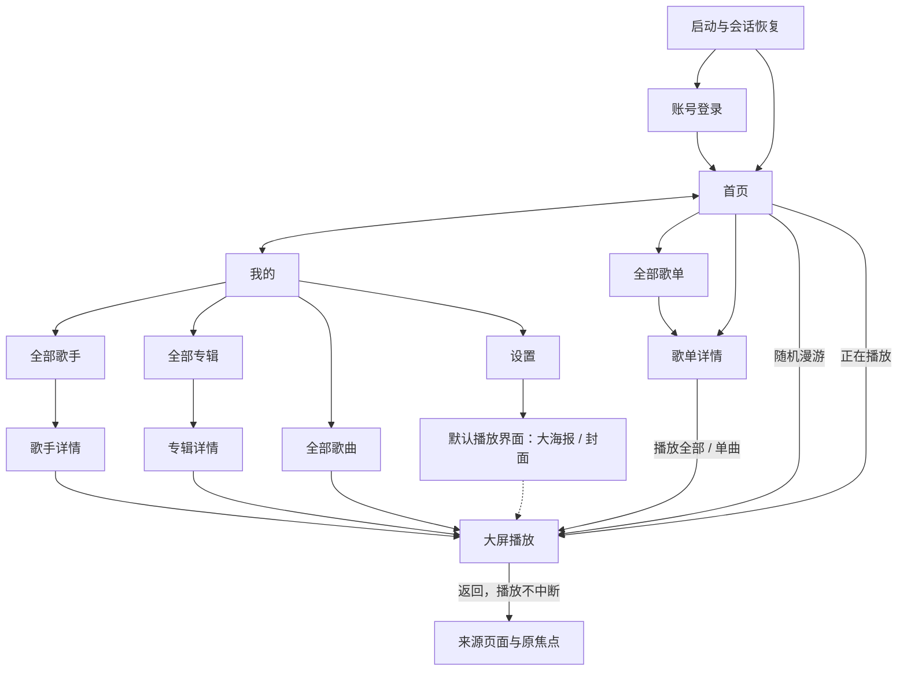
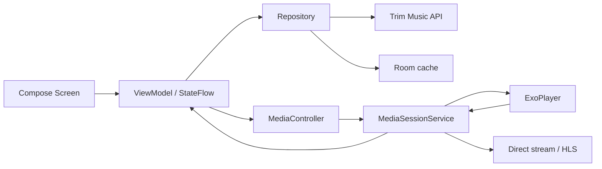
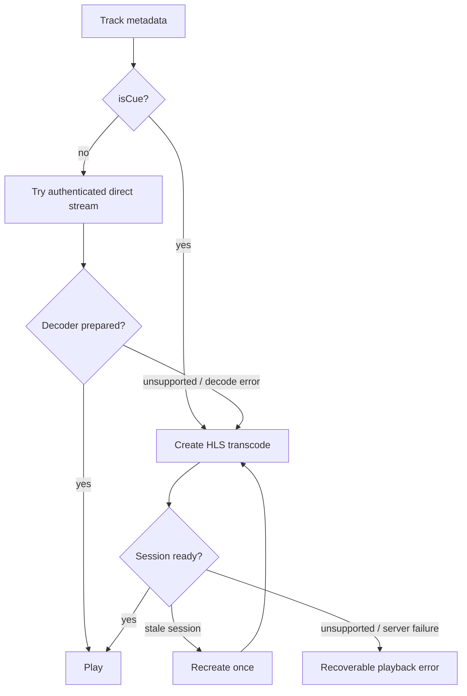

# TV 音乐客户端 V1 设计方案

## 1. 方案结论

V1 推荐使用原生 Android TV 技术栈：Kotlin、Jetpack Compose for TV、
Media3 ExoPlayer 与 MediaSessionService。应用采用单 Activity、分层数据访问和
独立于 Activity 的 MediaSessionService 生命周期（默认同进程），不复用现有 Web SPA，
也不使用 WebView。

推荐 `minSdk=23`、`compileSdk=36`、`targetSdk=36`。Android 6.0（API 23）是当前
Media3 播放栈的合理下限，
也能覆盖大多数仍在使用的 Android TV/盒子。首发 Vidda C3 Pro 已确认是 Android 系统，
最终 `minSdk` 仍需读取它的具体 API；
若必须支持 Android 5.x，应单独评估旧版 Media3/ExoPlayer 依赖和兼容成本。

### 1.1 核心取舍

| 决策 | 选择 | 原因 |
| --- | --- | --- |
| UI | Compose for TV + TV Material | 原生 D-pad 焦点、可测试的语义树、低层级页面适合声明式 UI |
| 播放 | Media3 ExoPlayer + MediaSessionService | 原生媒体键、后台播放、音频焦点、Range/HLS 支持和稳定生命周期 |
| 网络 | OkHttp + Retrofit + Kotlinx Serialization | 明确的认证拦截、流式接口与 JSON 契约分离、成熟可观测性 |
| 图片 | Coil，使用服务端固定缩略图尺寸 | 避免手工图片管线，能严格约束解码尺寸和缓存 |
| 本地数据 | Room + Preferences DataStore | Room 保存队列/元数据/歌词缓存，DataStore 保存轻量设置 |
| 依赖注入 | 小型手工 `AppContainer` | V1 模块少，可减少代码生成和启动工作；边界仍可在后续替换为 Hilt |
| 安全存储 | Android Keystore 包装的 token 存储 | 不保存密码；token 不以明文进入普通偏好或日志 |
| SDK | min 23 / compile 36 / target 36 | 当前 Media3 下限与 Android 16 稳定工具链；发布前复核商店政策 |

Flutter 可以完成界面，但当前 Flutter 3.44.7 的官方 Android 下限是 API 24，且 TV 焦点、
媒体会话和不同厂商解码兼容仍需较多原生桥接；
WebView 则会重复加载现有 1.65 MB Web 主包和浏览器媒体实现，并削弱遥控器、媒体键、
后台播放和内存控制。两者都不适合作为本项目 V1 主方案。

### 1.2 参考 TV APK 的代码取舍

正确参考 APK 是原生 View + Leanback 应用。可借鉴的是其静态/视觉职责划分和成熟 TV
产品模式，不是其反编译实现或旧依赖；Play Protect 阻止该旧 target APK 在 API 36 TV
模拟器运行，因此不宣称其焦点图和运行性能已经在真实 TV 环境得到验证：

| 参考原则 | 本项目的独立实现 |
| --- | --- |
| 全局 now-playing 与播放器共用状态 | 单个 MediaSessionService + MediaController 投影 |
| MainActivity 统一观察焦点、过滤快速按键 | Compose focus group、稳定 key、可测试的 key repeat single-flight |
| 播放页静止沉浸、控制层按需浮现 | 一个 Compose player route + transient controls overlay |
| 歌单头部与列表分离、主动作稳定 | TV Material 焦点组件 + LazyColumn 分页 |
| 加载/空/错误状态都保留遥控器恢复动作 | 每个 feature 统一 `UiState`，错误按钮保持焦点 |

明确裁掉参考 APK 中与 V1 无关或已过时的部分：103 个 Activity、23 个 Service、37 项权限、
`largeHeap`、旧 Leanback/ViewBinding 体系、内置 FFmpeg/音效/可视化、Lottie、视频、下载、
社交、会员与多频道模块。本项目生产代码默认只有一个 Activity、一个播放 Service 和四个
生产 Gradle 模块；不申请功能未使用的权限，不绑定 FFmpeg/Cronet/WebView/DASH/RTSP/IMA。

代码复用只发生在真实边界：统一 API envelope decoder、一个封面 URL 工厂、一个焦点组件
族、一个 queue/roam reducer 和一个 playback-source resolver。不会为每个页面复制播放器、
HTTP 模型或歌词解析，也不会为一次调用建立冗余 use-case 类。参考 APK 的 decompiled
Java/Kotlin/smali 和资源不进入源码、测试夹具或设计资产。

## 2. 产品信息架构

下图按 PRD 的推荐决策 D1 绘制，包含歌手、专辑和全部歌曲的只读下钻；方案评审未确认
D1 前，这些分支是条件范围而不是既定验收项。若 D1 被否决，“我的”保留不可聚焦概览，
并删除图中的 Artists/Albums/AllTracks 及详情分支，避免出现无响应焦点。



一级导航只有 `首页` 与 `我的`。歌单详情、设置和播放器都是任务页面，不加入一级导航。
全局播放状态属于 MediaSession，而不是某个页面；从播放器返回只改变 UI，不停止音频。
根返回规则固定：`我的` 按 Back 回 `首页` 并恢复上次首页焦点；`首页` 再按 Back 结束/
后台化 Activity，不能路由回自己形成陷阱。正在播放时 MediaSessionService 继续播放；没有
播放或仅暂停快照时持久化队列并允许服务停止。登录页 Back 仍直接退出应用。

## 3. 页面设计稿

设计评审基准为 1920x1080，所有关键内容位于至少 64 px 的安全边距内；1280x720 通过
固定断点缩放间距和组件尺寸，不按视口连续缩放字体。Vidda C3 Pro 若向应用暴露原生
3840x2160 surface，再增加 4K 断点/截图验证；不能直接把 1080p 画布和字体连续等比缩放。
卡片圆角不超过 8 px。

### 3.1 全局视觉系统

- 基础背景：近黑中性色 `#101214`，内容带 `#171A1E`，不使用全屏装饰渐变。
- 主要文字：暖白 `#F4F2EC`；次级文字 `#A9ADB4`。
- 焦点色：珊瑚 `#FF7657`；漫游辅助色：青绿 `#55C5A5`；警告：金黄 `#E8C36A`。
- 封面主色只作为播放器背景的低饱和色层，不替代焦点色和正文对比度。
- 焦点反馈：4 px 高对比描边、1.04 倍内容缩放和轻微阴影。组件外框尺寸固定，
  聚焦不得推动相邻元素。
- 正文字号不小于 24 px；一级标题约 48 px；当前歌词 48-54 px；辅助歌词 30-34 px。
- 文字字距固定为 0。歌名最多两行，歌手和歌单名默认单行省略。

### 3.2 启动与登录

**启动状态**

1. 立即显示轻量品牌占位和上次使用的背景色，不等待网络。
2. 读取本地 server、deviceId、加密 token 和播放器样式（无值时为大海报）。
3. 对服务器地址规范化并调用公开 `/sys/config`；以 `serverGUID` 隔离缓存，并展示
   `serverName`。有 token 时再请求 `/user/me`；成功进入首页，401 清理 token 并进入登录。
4. 网络不可用时允许进入仅包含已缓存内容和正在播放状态的壳层，并给出重试动作。

**登录布局**

- 左侧为产品名称和原创建的几何声波标识；右侧是窄表单区，不使用营销文案。
- 默认输入项：NAS 地址、账号、密码。地址只显示 host、可选 port 和 `/music/` 路径，
  默认预填最近一次有效值；尾部历史图标打开本机最近服务器单选列表，不扫描局域网。
- “HTTPS 安全连接”是独立开关并与地址共同规范化 origin；当前 HTTP NAS 首次默认关闭，
  关闭时显示“局域网 HTTP 连接未加密”，开启后以 HTTPS 探测 `/sys/config`。粘贴完整
  `http://` 或 `https://` 地址时必须同步开关；拒绝其他 scheme、URL 内嵌账号密码、空 host
  和跨 host 重定向。
- 聚焦输入框后调用系统 TV 软键盘；密码默认隐藏，右侧眼睛图标切换可见性。
- “保持登录”默认开启，只决定用户 token 是否写入 Android Keystore；关闭时 token 只在
  当前进程内存中存在。无论开关状态，密码在提交后都从 UI state 清除且绝不落盘。
- 主按钮为“登录”。提交期间按钮保持尺寸并显示进度；重复确认只发出一次请求。
- 错误显示在表单下方并保留账号与服务器，不保留或记录密码。
- 不出现二维码、扫码、手机授权、注册、忘记密码或“发现局域网服务器”入口。

**焦点图**：首次无有效地址时初焦 NAS 地址，已有有效地址时初焦账号；主纵向路径为 NAS
地址 -> 账号 -> 密码 -> 保持登录 -> HTTPS -> 登录。NAS 地址按右进入最近服务器、按左
返回地址，密码按右进入显示密码、按左返回密码。
返回键先关闭系统键盘，再退出应用。

### 3.3 首页

首页沿用 TV 样本的浏览节奏，但重新组织为 NAS 音乐的最短播放路径。

**顶栏**

- 左上固定 360x80 的正在播放入口。有播放上下文时显示 56 px 封面、歌名、歌手和
  播放状态；无上下文时显示静态产品标识且不可聚焦。
- 右侧只保留 `首页`、`我的` 两项。当前项用文字亮度和短底线表达，不使用胶囊按钮。
- 正在播放入口是独立焦点目标，可从两个一级页面快速回到播放器。

**主体**

- 标题使用时间问候或固定“听点什么”，不做超大营销式 Hero。
- 第一项为宽 440x292 的“随机漫游”入口，使用原创抽象封面和青绿状态标识。
- 后续是 320x292 常用歌单卡：先按本机最近打开的 playlist GUID 顺序解析，空位再按
  `/playlist/list` 返回顺序补齐；这不是服务端播放历史。最右侧保留下一项约 20% 的可见
  部分，提示可横向继续浏览。
- 歌单行末尾提供“全部歌单”，进入非一级导航的完整懒网格，不能再路由到“我的”。
- 焦点离开并返回首页时恢复原行、原卡和滚动位置。

**遥控器**

- 顶栏按下进入第一内容行；内容行按上返回最邻近的顶栏目标。
- 漫游入口确认后只触发一次 `/track/roam-start`，显示准备态；只有返回非空 current 才进入
  播放器。成功但 `data=null` 时在原卡显示“暂无可漫游歌曲”，保留焦点和重试，不打开空播放器。
- 歌单确认进入详情；正在播放确认进入当前播放器，不重建队列。

### 3.4 我的

“我的”是个人资料库浏览页。旧稿的三列仪表盘被否决：它同时混合列表、封面网格和统计，
形成三个导航轴、长距离横跳和大块无效空白，更像桌面管理后台。

- 顶部内容行左侧只放适中的“我的音乐”标题；右侧内联显示头像、账号、NAS 连接状态、
  切换账号和齿轮设置，不再使用一张横跨半屏的账号卡。
- 主体使用一个纵向 `LazyColumn`，依次放 `歌手`、`专辑`、`音乐库` 三条横向内容带。
  上下键切换内容带，左右键只在当前带内浏览，焦点始终停在相同的视觉基准线。
- 歌手带显示 5-6 个 200 px 圆形头像 lockup，下面是名称和歌曲数；末尾“全部”进入
  分页歌手网格，歌手卡进入歌手详情，详情展示专辑横行和歌曲列表。
- 专辑带显示 5-6 张约 260 px 的 400 px 封面 lockup、专辑名和歌手；末尾“全部”进入
  分页专辑网格，专辑卡进入带“播放全部”的歌曲详情。
- 音乐库带首项是宽 lockup“全部歌曲”，进入 `/track/list` 分页列表；后续共享库卡只显示
  名称、在线/不可用状态和最后变更时间，不显示 NAS 路径，也不做无响应的可聚焦按钮。
  `accessStatus=0` 为在线，其他/未知值统一为不可用，详细原因只进脱敏诊断。
- 每条内容带在右侧露出下一项约 15%-20%，屏幕底部露出下一条内容带标题；获得焦点时
  LazyColumn/LazyRow 自动把项目带回安全区，不使用竖分割线或总歌曲/歌手/专辑数字墙。
- 初始焦点是第一个歌手；按上进入顶部工具图，先落到空间位置最近的“正在播放”，再可向右
  依次经过首页、我的、账号、切换账号和设置，不做从左下区域直接跳到右上设置的跨屏跳焦。
  返回详情后恢复原内容带、GUID 和横向偏移。
- 三个区块独立加载和显示空/错态；任一区失败不替换整个页面，也不阻挡设置。

这种“纵向 section + 横向 media row”结构遵循 Android TV 官方 catalog browser 和
scrollable layout 模式，也符合 tvOS 对方向焦点、统一网格间距和下一项露边的通用原则。

**设置任务页**

- 从“我的”右上角齿轮进入全屏任务页，不加入一级导航，也不把页面段落包成多层卡片。
  页面只保留一条自上而下的设置焦点路径，避免侧栏与底层内容同时存在两个焦点平面。
- 第一组“播放界面”使用两段式选择器：`封面模式`、`大海报模式`。
- 首次安装默认选中大海报模式。每个选项带小型真实布局预览而非长说明。
- 确认后写入 DataStore 并留在设置页，不自动打开播放器；之后通过左上正在播放入口或
  新播放动作进入时按新布局渲染。底层 MediaItem、歌曲和进度始终不重建。
- 第二组“音频 + 图片缓存上限”使用单选菜单，提供 128/256/512/1024 MB，首次默认 512 MB；
  同一行显示当前使用量，下面提供带清理图标的“清除缓存”命令和确认对话框。
- 该上限只合计应用私有目录内 media/audio 与 artwork 两个 cache namespace：默认 75%
  给 Media3 播放分片、25% 给封面/海报；不包含 Room、日志、设置等应用数据。Room 资料
  索引不计入用户可调额度，但必须在设置副文案中标明“资料索引最多另占 32 MB”。
  Room 不做 190k 全库镜像：账号/设置/当前队列窗口保留，分页元数据与歌词按 lastAccessed
  LRU/TTL 淘汰；数据库物理文件超过 32 MiB 时清 evictable rows、checkpoint WAL 并执行
  incremental vacuum，仍不得删除当前队列/会话所需状态。
- 缓存只是 LRU 加速，不提供可管理、可保证或固定保留的离线入口；完整命中时在 NAS
  暂时离线且当前进程已验证用户会话时仍可能继续播放，这是透明缓存效果，不作为产品
  承诺。冷启动离线只能浏览缓存壳，必须先成功 `/user/me` 才允许音频起播。
- Media3/Coil 的 stock LRU 上限不热改。新额度立即持久化；播放器空闲且图片请求释放后
  安全重建 cache session，否则在当前曲目结束或下次进程启动时应用。清理先删图片与未锁
  media span，当前读取项在释放后删除，不能为“立即归零”中断音频。
- track/metadata/access 接口明确返回 `100004/100005` 或刷新后的 `accessStatus != 0` 时，
  立即停止/跳过该 track 并删除该用户 namespace 下的 media spans 与相关 artwork key；
  已确认拒绝后禁止从缓存播放。HLS 路径上的 session-not-found `100005` 只表示转码会话
  失效，按播放源规则重建，不得误删歌曲缓存。用户 token 失效/账号禁用则关闭 session
  并清理该用户缓存 namespace。
- 返回“我的”并恢复到齿轮按钮；从确认对话框返回则先关闭对话框并恢复触发动作焦点。

### 3.5 全部歌单

- 承接首页“全部歌单”，以 400 px 封面的懒网格展示 `/playlist/list` 返回的完整集合。
- 由于服务端列表不分页，客户端仍需增量绑定封面与 batch-detail 数量，不等待全部图片。
- 确认歌单进入详情；返回首页时恢复“全部歌单”入口焦点，再次进入恢复网格位置。
- 这是任务页，不加入顶部一级导航，也不在“我的”重复显示歌单。

### 3.6 歌手、专辑与全部歌曲

- 全部歌手和全部专辑使用 5-6 列懒网格、`page=1..n,size=50`，保留来源内容带焦点。
- 歌手详情用 300 px 头像、名称、歌曲/专辑数作紧凑头部，下方先放专辑横行，再放歌曲
  列表和“播放全部”；单曲或播放全部建立 `Artist` 来源的普通队列。
- 专辑详情复用同一个 `CollectionDetailScaffold`，但头部为 360 px 方形封面、歌手、年份、
  歌曲数，下面直接是歌曲列表；不能复制一套独立播放/分页实现。
- 全部歌曲使用与歌单详情相同的歌曲行和 50 首分页，不显示文件路径/大小；其普通队列
  来源为 `LibraryAllTracks`。
- 顶层 `/track/list` 不返回 `accessStatus`，实际 prepare/metadata 失败时按不可播放歌曲
  跳过并提示，不能假定所有列表项可播。
- 这些页面只读，只提供浏览、播放全部和单曲播放，不提供编辑、收藏或音乐库扫描。

### 3.7 歌单详情

- 顶部为 360x360 封面、歌单名、歌曲总数和“播放全部”主动作。
- 右侧/下方歌曲列表只显示序号、标题、歌手和时长，不显示格式、大小、路径等桌面字段。
- 当前播放歌曲使用左侧声波图标和文字颜色提示；不可访问歌曲保留位置但降低对比度，
  确认时给出简短原因，连续播放自动跳过。
- 每次加载 50 首，距离页尾约 15 首时预取下一页。播放全部可从第一页立即开始，
  后续分页在队列后台追加；不使用 `size=-1`。
- 单曲确认从当前歌曲开始建立同序队列并进入播放器。
- 返回恢复来源页卡片；再次进入该歌单恢复歌曲列表焦点和偏移。

### 3.8 大屏播放：封面模式

- 左侧约 560x560 的清晰方形封面，下面只放歌名、歌手和音质/转码的被动状态。
- 右侧为歌词主列，当前行居中偏上，前后各保留 2-3 行上下文。
- 背景由封面主色降饱和后形成单色层，并叠加固定深色遮罩确保文字对比；不实时模糊封面。
- 控制层默认隐藏。任何方向键或菜单键唤出后，底部显示进度、时间、上一首、播放/暂停、
  下一首；5 秒无操作淡出。控件淡入淡出不改变主布局尺寸。
- 页面内不显示布局切换、模式标签或设置入口。

### 3.9 大屏播放：大海报模式

- 左侧约占 46% 宽度，用 `ContentScale.Inside` 完整显示且不放大低清封面/海报。
  该模式单独请求不带
  `size` 的原图，在客户端按容器限尺寸解码：1080p/low-RAM 目标长边约 1200 px；
  Vidda C3 Pro 若向应用暴露原生 4K 且不是 low-RAM，可提高到约 1920 px，但同屏仍只
  保留一张前景大图。
- 方形图保持方形，横图可占满更宽区域，竖图保持完整比例；禁止拉伸和低清放大。
- 右侧顶部显示歌名、歌手和被动音频状态，下面为更紧凑的同步歌词列。
- 双语歌词在同一时间点上下排列：原文为主，译文小一级；当前组高亮，邻近组降对比。
- 每个 lyric group 预留稳定高度；原文和译文各最多换行 2 行，之后才省略。当前原文默认
  48-54 px，测量超过两行时可按离散 token 降至最低 36 px，不按视口连续缩放；禁止
  `nowrap` 把核心歌词截成一行，也禁止换行推动歌曲信息或底部控制层。
- 缺图时用歌名/歌手首字母驱动的原创几何占位，不生成伪海报。
- 原图超过 20 MiB、任一边超过 8192 px、总像素超过 16 MP 或解码失败时，回退服务端
  800 px 方形缩略图；不能为保持比例而解码不受限的超大位图。
- 首次安装默认使用本模式。它与封面模式共用一个播放器和控制层，布局由设置偏好决定。
- 页面内不显示布局切换、模式标签或设置入口，静止状态只保留海报、歌曲信息和歌词。

### 3.10 播放页遥控器规则

| 按键 | 控制层隐藏 | 控制层显示 |
| --- | --- | --- |
| 确认 | 播放/暂停并短暂显示控制 | 激活当前焦点；焦点不在按钮时播放/暂停 |
| 左/右 | 只显示控制并把焦点放到播放键，不 seek | 进度条聚焦时 10 秒 seek；按钮区移动焦点 |
| 上/下 | 显示控制并进入对应控制区域 | 在进度条、传输按钮和辅助状态之间移动 |
| 返回 | 返回来源页面，播放继续 | 先隐藏控制层 |
| 播放/暂停键 | 全局播放/暂停 | 全局播放/暂停 |
| 上一首/下一首键 | 切换队列或漫游节点 | 切换队列或漫游节点 |

播放器不提供 V1 范围外的收藏、评论、音效和队列编辑入口。系统音量由遥控器硬件键处理。
控制层隐藏时，任一方向键的第一次输入只用于显控件，避免用户在看歌词时误 seek 或切曲；
显控件后才按当前焦点解释后续方向键。
漫游激活时，临时控制层额外显示明确的“退出漫游”命令；它是结束随机会话的唯一显式动作，
不属于播放器布局切换。

## 4. 状态与数据流



### 4.1 Gradle 与代码边界

V1 使用四个模块，避免一开始拆成大量 feature module：

```text
:app
  activity, navigation, feature/auth, feature/home, feature/my,
  feature/playlist, feature/player, feature/settings, ui/designsystem
:core:model
  API-independent domain models, identifiers, errors, player-style enum,
  queue/roam reducers, pure LRC parser
:core:data
  Retrofit DTOs, response decoding, repositories, Room, DataStore,
  token/device/server stores, cover URL factory, playback-source resolution
:core:playback
  MediaSessionService, ExoPlayer, media-source resolver, queue and roam adapters
:baselineprofile
  non-production Macrobenchmark and Baseline Profile generation
```

依赖方向为 `app -> core:model/core:data/core:playback`，
`core:playback -> core:model/core:data`，
`core:data -> core:model`。UI 不解析原始 JSON，播放服务不引用 Compose 类型。

### 4.2 状态归属

| 状态 | 唯一归属 | 持久化 |
| --- | --- | --- |
| server URL、deviceId、token | `SessionRepository` | server/deviceId 明文，token Keystore 加密 |
| 播放界面样式 | `PlayerPreferences`，默认 `Poster` | Preferences DataStore |
| 音频 + 图片缓存上限 | `CachePreferences`，默认 512 MiB | Preferences DataStore |
| 页面数据与加载错误 | 各 feature ViewModel | Room 按 `(serverGUID,userGUID)` 缓存 |
| 普通播放队列 | `QueueRepository` + MediaSession | Room 按 `(serverGUID,userGUID)` 保存 GUID、来源、顺序、当前项、进度 |
| 漫游链 | `RoamRepository` | 运行期；只保存恢复提示，不承诺跨服务重启续接 |
| 播放/缓冲/进度 | ExoPlayer + MediaSession | 当前项/位置节流写入队列快照 |
| 原始与解析歌词 | `LyricsRepository` | Room 按用户 namespace、歌词 GUID 和 updatedAt 缓存 |

普通队列和漫游状态必须是两个独立对象。进入漫游时冻结普通队列快照；退出漫游时恢复它，
不把漫游歌曲插入普通歌单顺序。

### 4.3 认证模型

- 每次安装生成稳定随机 `deviceId`，不使用可重置的广告 ID 或硬件序列号。
- 地址规范化接受 host[:port]、origin、`/music/` Web 地址或完整 `/music/api/v1` 地址；粘贴
  带 scheme 的地址时同步 HTTPS 开关，然后将 scheme 开关 + host/port/path 结构化生成 API
  base。保存前必须以 `/sys/config` 探针成功为准，禁止用字符串拼接处理 HLS 相对/绝对 URL。
- 登录向 `/user/password-login` 发送 username、password、deviceId。
- `Authorization` 直接放原始 token，不加 `Bearer`；原生客户端不混用 Cookie。
- 冷启动以 `/user/me` 校验。仅经过用户 token 认证的 JSON API 返回 HTTP 401、
  `code=99999` 或 `code=120001` 时，才清除用户 token 并回登录；`120002` 清除 token、
  回登录并显示“账号已禁用”。query tempToken 模式的媒体 401 只申请新 temp token 并
  重试同一 transcode session/generation；raw 用户 Authorization 模式的媒体 401 先调用
  `/user/me`，确认用户 token 失效才登出。只有 HLS manifest/segment 404 或对应 session
  not-found `100005` 才重建 transcode；禁止由全局 OkHttp 401 拦截器直接登出或换票时
  顺带创建新 session。
- query-token 媒体的所有 Media3 `DataSpec` 必须经过 track-scoped `ResolvingDataSource`：
  请求 manifest、segment、key 或重连 Range 前移除 URI 中旧 `tempToken`，注入该 track
  当前票据。媒体 401 触发该 track 的 single-flight 换票，更新 resolver 后重试同一 URL
  语义和同一 transcode generation；必要时重新载入同 generation manifest 并按原位置/
  `playWhenReady` 恢复。禁止直接重试带旧 query 的缓存 DataSpec。
- playlist/page/queue/lyrics 与图片都以 `(serverGUID,userGUID)` 隔离；图片完整 key 为
  `(serverGUID,userGUID,coverId,variant)`。切换账号或登出先停止并清空当前 MediaSession、
  取消图片请求并清空内存图片，再断开 Controller 投影和切换数据 namespace；不得显示
  或恢复前一账号队列/封面。旧账号磁盘图片可等待 LRU 或异步清理，但在新 namespace
  不可寻址。
- HLS session、临时 token 或漫游失效不能误判为用户登出：分别重建转码 session、只换
  临时票据、或重启漫游上下文。
- 不保存密码。日志、崩溃信息、MediaItem URI 和诊断导出均需清除 token 与 URL 查询票据。

### 4.4 API 映射

| UI/领域动作 | 服务端接口 | 客户端规则 |
| --- | --- | --- |
| 校验服务器 | `GET /sys/config` | 公开探针；保留 `serverGUID`、`serverName`、`serverVersion`、`mediasrvVersion` 并隔离缓存/建立兼容矩阵 |
| 密码登录 | `POST /user/password-login` | 稳定 deviceId；原始 Authorization token |
| 会话恢复 | `GET /user/me` | 仅真实认证失败清 token |
| 首页歌单 | `GET /playlist/list` | 本地懒渲染，不阻塞全部封面 |
| 歌单数量 | `GET /playlist/batch-detail` | 对可见/近可见 GUID 分批请求 |
| 我的歌手概览 | `GET /artist/list` | 小页分页，不使用 list-all |
| 我的专辑概览 | `GET /album/list` | 小页分页，400 px 封面 |
| 我的音乐库概览 | `GET /shared-library/list` | 只展示名称/可用状态/变更时间，不显示 path |
| 歌手详情 | `/artist/detail`、`/album/artist-detail/list`、`/track/artist-detail/list` | 专辑与歌曲各自分页，统一 collection UI model |
| 专辑详情 | `/album/detail`、`/track/album-detail/list` | 歌曲 size=50，建立 Album 队列 |
| 全部歌曲 | `GET /track/list` | size=50，不使用 size=-1；准备失败再标记不可播 |
| 歌单头部 | `GET /playlist/detail` | 与列表缓存合并，不以客户端 DTO 直接渲染 |
| 歌单歌曲 | `GET /track/playlist-detail/list` | page=1..n、size=50、稳定 GUID key |
| 歌曲播放信息 | `GET /track/metadata` | 决定 direct/HLS；不可依赖 NAS path |
| 原始流 | `GET /track/stream` | 支持 Range；CUE 禁止使用 |
| HLS | `POST /track/transcode` + hls URL | CUE 或 direct 解码失败时使用 |
| HLS 存活 | heartbeat / quit | 隔离在 `TranscodeSessionAdapter`，实机验证参数契约 |
| 歌词 | `GET /lyric/list` | 异步于音频，客户端解析 raw LRC 和 offset |
| 漫游 | roam-start / previous / next | 按 roamId 串行请求，陈旧 session 自动 start |
| 封面 | `GET /static/cover` | 列表 200/400、封面播放器 800；仅海报播放器省略 size 取原图并限尺寸解码 |

### 4.5 统一错误边界

所有 JSON 在 `core:data` 入口统一解码：

1. 先判断 HTTP 状态。
2. 再判断 JSON 包络 `code == 0`。
3. transcode/heartbeat/quit 必须精确满足 `data.status == "success"`，null、unknown 或
   `failed` 一律 fail closed 并映射为转码 session 错误。
4. 文件/HLS 响应按媒体状态处理；但 200 响应交给 Media3 前必须检查 `Content-Type`，
   若为 JSON 则按 API 包络解码，避免把无权限/不存在误报为解码失败并错误触发 HLS 降级。

对 UI 只暴露稳定错误类型：`Unauthenticated`、`NetworkUnavailable`、`NotFound`、
`UnavailableTrack`、`MediaUnsupported`、`TranscodeUnavailable`、`Empty`、`Unknown`。

## 5. 播放设计

### 5.1 单一播放器

应用只创建一个 ExoPlayer 和一个 MediaSession。所有页面通过 MediaController 发命令，
不能在播放器页面、迷你播放入口或 ViewModel 中各自创建 player。MediaSessionService 负责：

- 音频焦点、耳机/HDMI 中断、媒体键与系统播放卡片；
- 普通队列顺序、当前项和 next/previous；
- direct 与 HLS MediaSource 生命周期；
- 播放状态、buffering、错误和位置的统一 Flow；
- app 在前后台切换时保持播放。

### 5.2 播放源决策



- CUE 直流会返回整个底层文件，因此必须直接走 HLS。
- 非 CUE 先使用带认证 header 的 Progressive MediaSource；Range 交给 Media3 管理。
- direct 出现明确解码不支持时同曲只自动降级一次，避免错误循环。
- direct -> HLS 降级或 HLS stale 重建前，原子快照同一 MediaItem 的 position 与用户
  `playWhenReady` 意图；新 source ready 后 seek 到最近有效位置再恢复。CUE 使用分轨内相对
  position，不能再叠加底层文件 startOffset；原先暂停则保持暂停，禁止因恢复自动发声。
- HLS manifest 与分片优先统一携带用户 Authorization header；仅在目标设备/数据源无法
  可靠传播 header 时申请限定 track scope 的临时 token。query-token 模式使用上述
  `ResolvingDataSource` 在每次请求时替换票据，不能信任 manifest 内嵌 query 永远有效。
- 服务端未公开 codec profile 和 heartbeat 的完整契约。实施第一阶段必须用代表性
  MP3/FLAC/APE/CUE 在真实 NAS 上完成 HLS 探针，再将确认值封装进 adapter，不散落在 UI。
- 停止、切曲或降级重建时显式 quit 旧转码 session；NAS 重启后的 404/失效重建一次。
- transcode create 是非幂等单飞操作：同一 track 同时最多一个在途 POST，关闭 OkHttp 对该
  调用的透明重试，read/call timeout 必须大于 M0 实测的 mediasrv 最坏上界（当前服务内部
  上界约 50 秒并留安全余量）。仅能证明请求体未发送时可自动重试；请求已发送后的超时、
  断线或响应丢失属于 ambiguous outcome，不得立即再 POST。UI 保持可操作准备失败态，等待
  已测服务端上界过去后受控 quit/reconcile，再由用户重试；清理结果仍不确定时禁止盲建第二
  session。heartbeat 等幂等操作使用各自的有界重试策略，不能共享 create 策略。

### 5.3 队列与恢复

- “播放全部”按当前 collection 的服务端排序建立普通队列，第一批即可播放，后续批次顺序追加。
- 单曲播放从所选位置开始，前后仍保持当前 collection 顺序。
- `QueueSource` 是封闭类型：`Playlist(guid,sort)`、`Artist(guid,sort)`、
  `Album(guid,sort)`、`LibraryAllTracks(sort)`；UI 不用字符串猜测分页接口。
- Room 快照以 `(serverGUID,userGUID)` 为 namespace，只保存 track GUID、QueueSource、顺序、
  当前 GUID、位置和时间戳；
  元数据恢复后重新解析，避免长期复制过期 API DTO。
- 队列不是无限增长数组。运行期/Room 只保留以当前项为中心最多 5 页（前 2 + 当前 + 后 2，
  pageSize=50，最多约 250 个 GUID/MediaItem）的滑动窗口，并保存 source sort、当前绝对
  index、已知 total 和可重放 page keys。跨窗口 previous/next 时先加载相邻页，提交新页后
  才从远端移除旧 MediaItems；190k “全部歌曲”不能把全库 GUID 写进 Media3 timeline/Room。
- 每 5 秒且位置变化时节流保存，暂停/切曲/应用退后台时立即保存。
- 冷启动恢复为暂停状态，左上角正在播放入口可重新进入；不自动发声。
- 队列项不可访问时自动跳过并短暂提示。全部不可用时停止在可恢复错误态。
- 后续分页只允许一个请求；在离已加载队尾 15 首时预取，失败按 0.5/1/2 秒最多自动
  重试 3 次。页结果先按 GUID 去重并校验顺序，再原子追加和提交 page key，失败时保留
  已加载队列且不推进页码。若播放到已加载队尾仍失败，当前曲结束后停在“下一页加载失败”
  可恢复状态，提供聚焦的“重试”动作；不能把网络失败当作自然队尾或重建整条队列。
- 服务端当前没有 playlist revision/snapshot，offset 分页无法在 NAS 端并发增删歌曲时保证
  无漏项。上述去重、绝对 index 和顺序门槛只针对同一稳定服务端排序快照；活跃队列期间的
  外部修改可以延后到下次打开反映。若页首/页尾锚点或已知 total 显示漂移，停止追加并进入
  “歌单已更新，重新载入”可恢复状态，不能悄悄拼接两个版本或宣称顺序仍完整。

### 5.4 漫游

- `roam-start`、`next`、`previous` 同一时刻只允许一个请求，快速连按合并为最后一个意图。
- start 成功但 `data=null` 作为可恢复空状态；window 的 previous/next 为 null 时对应控制禁用
  或省略，不能发出缺少 `relativeRoamId` 的请求。
- 预取一个 next window，不批量启动多个随机会话。
- `roamId` 失效、服务重启或 24 小时过期时，提示“漫游已重新开始”并调用 start。
- 文案统一叫“随机漫游”，不声称个性化推荐。
- 漫游期间保留普通队列快照；用户从歌单开始播放即退出漫游并建立新普通队列。
- 已处于漫游时再次确认首页“随机漫游”只返回当前漫游播放器，不重复 roam-start，也不
  覆盖最初冻结的普通队列快照；只有从非漫游状态第一次进入时才冻结一次。
- 用户在播放器临时控制层选择“退出漫游”时，丢弃客户端 roamId/漫游状态，恢复漫游前的
  普通队列、当前歌曲和位置并保持暂停，避免电视突然播放旧内容；服务端没有 roam quit，
  其内存 session 只能等待 24 小时过期、服务重启或下次 start 覆盖。
- 若漫游前没有普通队列，退出后停止播放并返回首页空播放状态。

## 6. 歌词设计

`LyricsRepository` 保存服务端原文并生成统一 timeline：

- 支持 BOM、metadata tag、多时间戳一行、1-3 位分钟、不同小数精度、空行和坏行。
- 每行生成 `startMs`，按开始时间稳定排序；结束时间取下一有效行或歌曲结束。
- offset 正负方向由 M0/M4 的现有 Web 行为探针冻结为一个单点 `applyLyricOffset` 契约；
  在 `+1000/-1000 ms` 两向实测完成前，不假设公式是加法或减法，也不把符号逻辑散落在 UI。
- 同一时间点的相邻多语言文本合并为一个 lyric group；不能可靠识别时保持原顺序，
  不猜测翻译。
- `isLRC=false` 时作为静态全文展示，不报错。
- 服务端空列表无法区分纯音乐与缺歌词，统一显示“纯音乐或暂无歌词”；加载中、网络失败
  分别显示独立状态，歌词请求失败不影响音频。
- 播放时最多每 250 ms 采样一次位置，并用二分查找当前行；只有 active index 改变时
  触发歌词列表重组与滚动。
- 歌词滚动使用固定行高和预计算位置，切换播放器布局时保持 active index。
- UI 以固定 lyric-group slot 渲染：原文/译文各最多 2 行，长文本在最低字号仍超限才省略；
  单个超长无空格词允许断词，不能越过歌词列或遮挡相邻组。

## 7. 缓存与性能预算

首发性能/正确性基准改为用户确认的 Vidda C3 Pro（MT9681、4 GB/128 GB、4K）；M0 先读取
其实际 Android API、ABI、逻辑 surface 与 density。API 36、2 GB、1080p TV AVD 用于确定性
D-pad/布局回归，低档 2 GB 真机用于兼容压力测试，均不能替代首发投影仪放行。

| 指标 | V1 目标 | 实现约束 |
| --- | --- | --- |
| 冷启动首帧 | <= 1.5 秒 | 启动不等待网络、Room 或大图 |
| 有缓存进入可操作首页 | <= 2.5 秒 | 先缓存后刷新，认证校验不阻塞壳层绘制 |
| D-pad 焦点反馈 | p95 <= 80 ms | 稳定 key、固定尺寸、无焦点时网络工作 |
| 列表滚动 | 1080p 每段脚本 >=95% 帧 <=16.7 ms；相邻两帧均 >100 ms 的序列为 0 | LazyRow/LazyColumn、release/R8、Baseline Profile |
| LAN direct 可听 | p95 <= 1.5 秒 | 先播音频，歌词/大图并行 |
| HLS 可听 | 暂定 p95 <= 4 秒，M0 实测后冻结 | 预创建 session、单次重建、真实 NAS 压测 |
| 内存 | 基准设备 PSS 目标 <= 180 MB；总进程硬门槛 < 280 MB，Anonymous+Swap+Graphics < 200 MB | 限制 bitmap 与队列模型，避免 WebView/WASM；低内存设备降级 |
| 图片内存缓存 | 24 MB 起，按设备调优 | 列表/封面 200/400/800；海报原图只保留限尺寸结果 |
| 音频 + 图片磁盘缓存 | 默认 512 MiB，可选 128/256/512/1024 | 默认 media 75% + artwork 25%，资料索引作为应用数据最多另占 32 MiB |
| 歌曲分页 | 50/页，余 15 首预取 | 禁止 `size=-1`，取消过时请求 |
| 歌词更新 | <= 4 Hz，active index 变化才重组 | 二分定位，静态行模型 |

其他约束：

- 列表只取 200/400 px，封面模式只取 800 px，不请求 API 示例中的 512 px，因为该值会
  意外退回原图。大海报模式是唯一原图例外：省略 size、限制编码体积/像素维度、按容器
  在 1080p/low-RAM 下采样到长边约 1200 px；C3 Pro 原生 4K surface 可提高到约 1920 px，
  并在不满足阈值时回退 800 px。
- Progressive cache key 为
  `(serverGUID,userGUID,trackGUID,localStreamGeneration,direct)`。`track.updatedAt` 只是
  metadata 变化提示，不证明音频文件身份；响应强 ETag 才是首选内容 validator，并与
  Last-Modified、`resourceLength`、validatedAt 一起持久化，不能事后拼进正在写入的 key。
  超过服务端 24 小时 max-age 或 updatedAt 变化时，用 `If-None-Match`（无 ETag 时用
  `If-Modified-Since`）+ `Range: bytes=0-0` 预校验。`resourceLength` 在 200 响应取
  Content-Length，在 206/416 响应解析 Content-Range 的 total，304 沿用旧值；206/416 的
  Content-Range 缺失、非法或 total 未知时 fail closed，清旧 spans 并全量重取，不能把 206
  响应体的 1 字节 Content-Length 当作资源总长。304 只刷新 validatedAt；validator 或
  resourceLength 变化则删除旧 spans、递增 generation 后重新读取。两种 validator 都缺失时，TTL
  到期必须递增 generation 并完整重取；带 validator 的部分缓存续传必须发送 `If-Range`，
  无 validator 的部分缓存不得续传。离线只允许读取已知完整的旧 generation，绝不拼接
  不同 generation。HLS manifest 不长期缓存；每次 transcode create 成功都生成新的本地
  `transcodeSessionGeneration`，segment key 包含该 generation、CUE 起止、转码
  codec/bitrate/profile、rendition 和规范化 segment path/sequence。服务端会跨 session
  重用 manifest/segment 路径，因此 V1 不跨转码 session 复用 HLS 分片。所有 key 去掉
  Authorization、tempToken 和其他易变查询参数，且不同 segment 绝不能共用 track 级 key。
- 主色提取只在新 800 px 封面落盘后执行一次，结果随 cover cache key 保存。
- 不使用运行时全屏模糊、粒子、动态 shader、视频背景或持续调色动画。
- 列表模型使用不可变值、GUID 稳定 key 和分页快照；不在 Composable 内排序或解析 JSON。
- release 构建开启 R8/resource shrink，并为启动、首页横滑、歌单纵滑、打开播放器建立
  Baseline Profile 与 Macrobenchmark。
- 初始稳定版本固定 Compose BOM `2026.06.00`、TV Material `1.1.0`、Media3 `1.10.1`；
  通过 version catalog 管理，禁止动态版本，实施启动时再次核对官方 release notes。
- 网络请求以 screen lifecycle 取消；可见缓存留在页面，不用全屏 loading 替换。
- 用户额度是上限而非预分配。磁盘剩余空间不足、ENOSPC、I/O 异常或 `SimpleCache` 索引
  损坏时，media/artwork 写入必须 fail open：停止本次写缓存并改用网络/内存，不中断当前
  音频。损坏 cache session 关闭并在安全点重建应用私有缓存目录；设置页报告真实用量和
  “存储空间不足，暂不缓存”，不能显示虚假占用或因清理失败崩溃。

### 7.1 固定测量协议

- 全部使用 release + R8 + Baseline Profile 构建；NAS 接有线局域网并处于空闲状态，记录
  客户端/服务端版本、设备温度和网络方式。基准设备未达硬门槛时不能用“设备例外”放行。
- 冷启动：每台设备 force-stop 后测 10 次缓存首页和 5 次清数据首次启动，报告 median/p95；
  TTID 与 `reportFullyDrawn` 的 TTFD 分开记录。
- 播放启动：direct 与 HLS 各测 30 次，从用户确认到首个音频帧；一半使用冷连接、一半
  使用热连接，失败也计入。HLS 的正式目标在 M0 样本完成后冻结，不能在 M5 临时下调。
- 焦点：在首页、全部歌单、歌单详情、设置和播放器控制层执行至少 200 次方向键，使用
  frame trace 统计按键到焦点描边呈现的 p50/p95/max，并记录任何丢焦/重复导航为失败。
- 滚动：首页横行、全部歌单网格和 3500 首歌曲列表各执行 3 段 10 秒固定脚本；每段独立
  统计 FrameTiming，要求 >=95% 帧 <=16.7 ms，并且不能出现相邻两帧均 >100 ms 的序列。
  同时记录 jank 百分比、最长帧和连续慢帧次数，而非只凭录像判断。
- 队列内存另用固定、不并发修改的 190k synthetic collection 连续跨越至少 500 页并随机
  previous/next；timeline/Room 窗口始终 <=250 项、绝对 index/顺序不漂移，PSS 不随已遍历
  总数线性增长。另用并发增删夹具验证锚点漂移能进入可恢复重载，而非伪装成稳定快照。
- 歌词：至少 20 次自然换行和 10 次 seek，当前行相对时间轴误差 <=250 ms，seek 后
  <=300 ms 恢复正确行。
- 内存：执行“首页 -> 全部歌单 -> 3500 首详情 -> 大海报 -> 返回”15 分钟循环和 2 小时
  连续播放，记录峰值/稳态 PSS 与 Anonymous+Swap+Graphics；发生 LMK 或 bitmap OOM 即失败。

## 8. 网络与安全

- 现有服务地址是 HTTP，且 host 运行时可编辑，Android 的静态 Network Security Config
  无法只放行未知 NAS host。因此兼容构建需全局声明 cleartext permitted，但应用网络层只
  允许规范化后的已配置 origin；登录页对 HTTP 显示一次克制警告。生产部署优先建议 NAS
  反向代理 HTTPS，并可提供 HTTPS-only 构建关闭 cleartext。
- server URL 只接受 `http/https`、有效 host 和可选端口/基础路径，拒绝嵌入用户名密码。
- JSON、封面和媒体请求只解析到配置 origin；默认拒绝跨 host 重定向，服务端返回的 HLS
  相对/绝对路径必须归一化后仍为同 origin。应用不加载歌曲元数据中的任意远程 URL。
- HTTPS 默认只信任系统 CA。若明确要支持用户安装 CA，使用限定域/构建类型的
  Network Security Config 并单独验收；不做 trust-all `TrustManager`。证书 pinning
  不是自签证书兼容手段，家庭 NAS 地址变化也不适合默认 pinning。
- token、密码、临时播放票据不进入日志、analytics、崩溃 breadcrumbs 或明文 Room。
- 图片、JSON、媒体三类 OkHttp client 共享连接池，但使用独立 timeout 与拦截器；媒体读取
  不受普通 JSON 短超时影响。
- 不嵌入 WebView，不执行服务端返回的 HTML/JS，不从歌曲元数据加载任意远程网页。

## 9. 可恢复错误体验

| 场景 | 用户看到 | 恢复动作 |
| --- | --- | --- |
| 登录密码错误 | 表单内错误，账号保留 | 修改后重试 |
| 用户 token 过期 | 回登录并说明会话过期 | 重新输入密码 |
| NAS 离线 | 当前缓存保留，顶部连接状态 | 自动退避 + 手动重试 |
| 歌单空 | 稳定空状态 | 返回我的/首页 |
| 单曲不可访问 | 行禁用或切曲提示 | 连续播放跳到下一首 |
| direct 解码失败 | “正在切换兼容播放” | 自动尝试一次 HLS |
| HLS session 失效 | 短暂准备态 | 重建一次，不清用户登录 |
| HLS 不可用 | 播放错误和重试/下一首 | 用户选择，不死循环 |
| 歌词空/失败 | “纯音乐或暂无歌词”或重试状态 | 音频继续 |
| 漫游 session 失效 | “漫游已重新开始” | 自动 roam-start |
| 漫游无候选 | 首页原卡显示“暂无可漫游歌曲” | 保持焦点，可重试或进入歌单 |

所有重试按钮均可保持焦点；快速连续确认通过 single-flight 或 debounce 防止重复导航、
重复登录、重复漫游 session 和多个 ExoPlayer prepare。

## 10. 测试与质量门槛

### 10.1 自动测试

- 单元测试：API 包络、401/业务错误/转码三层错误，URL 和认证头，LRC parser，歌词 offset，
  queue reducer，roam stale recovery，播放源决策，设置持久化。
- Repository 测试：MockWebServer 覆盖分页、空值、超时、Range、401、错误 JSON 和服务重启。
- ViewModel 测试：加载/缓存/错误恢复、重复按键 single-flight、普通队列与漫游隔离。
- Compose UI 测试：初始焦点、四向邻接、返回恢复、长文本、空态、设置即时切换。
- Media3 集成测试：MP3/FLAC direct、APE 等不支持格式降级、CUE HLS、seek、后台/前台、
  HDMI 音频焦点和媒体键。
- Macrobenchmark：冷启动、首页横滑、3500 首歌单纵滑、播放器打开、两布局切换。

### 10.2 设备矩阵

- 已准备的 API 36 Android TV emulator：720p 与 1080p D-pad/布局；最低 API 另由 CI/可用
  镜像验证。
- 首发 Vidda C3 Pro：实际 API/ABI、侧载/启动器、遥控器、系统键盘、逻辑 1080p/4K
  surface、内置 JBL/外接音频和长时间播放全量验收。
- 一台 2 GB 低档真实 Android TV 盒子作兼容压力测试；若当前无法取得，不阻塞面向 C3 Pro
  的侧载版，但在完成该真机验证前不得对外宣称广泛低配 Android TV 兼容。
- 标准 D-pad 遥控器、带独立媒体键遥控器、系统软键盘。
- NAS 代表媒体：MP3、FLAC、AAC/M4A、APE/WMA 等可能不支持格式、CUE 分轨；
  同步 LRC、静态歌词、双语、无歌词、长歌词；方/横/竖/缺失封面。

### 10.3 发布硬门槛

- 真实 TV 上没有焦点死角、焦点丢失、不可见焦点或返回栈异常。
- 720p/1080p 没有文字遮挡、越界或 overscan 截断。
- 用户 token、密码和临时票据不出现在可检索日志中。
- CUE 不走 direct；不支持格式能可靠降级或明确失败。
- 普通队列在漫游前后保持一致；重启后不自动发声。
- 封面/大海报设置即时生效并重启保留。
- 基准设备必须达到性能表全部硬目标；其他设备的未达项另列可量化兼容性记录，不能据此
  豁免基准设备。

## 11. 已知风险与前置验证

| 风险 | 优先级 | 处理 |
| --- | --- | --- |
| Vidda C3 Pro 已确认 Android，但 API/ABI/实际 app surface 未读取 | P0 | M0 首先读取 About/ADB，并冻结 minSdk、launcher 与 1080p/4K 资源策略 |
| C3 Pro 可能不声明标准 television/Leanback feature | P0 | 侧载 flavor 将两者 required=false，并按实测决定普通 launcher alias；Play TV 另用 required=true 的 store overlay |
| HLS codec、heartbeat 单位/频率未形成服务端契约 | P0 | 第一阶段 NAS 实机探针；必要时补服务端 capability 接口 |
| 现有 HTTP 登录明文经过 LAN | P0 | 支持当前环境但明确警告；生产建议 HTTPS |
| API 36 TV AVD 已就绪但会错误声明 touchscreen，且软件渲染不能代表真机性能 | P0 | 用该 AVD 做 D-pad/1080p 正确性；用 C3 Pro 做发布性能与无触摸启动门槛，低档真机只扩展兼容结论 |
| 30 天 token 无 refresh | P1 | 401 后可恢复登录；后续服务端补 expiredAt/refresh |
| 漫游/HLS/temp token 服务重启即失效 | P1 | 分类型重建，不能误清用户 token |
| transcode create 非幂等且响应丢失后结果不确定 | P1 | 单飞、长超时、仅未发送可重试；等待上界后清理，服务端补 idempotency/status |
| 大型曲库和 3500 首歌单 | P1 | 分页队列、懒图片、稳定 key、宏基准 |
| 不同封面比例破坏海报布局 | P1 | Fit、稳定容器、五类素材截图测试 |
| 海报原图过大或 800 缩略图已方形裁切 | P1 | 海报独立原图管线、限尺寸解码、失败回退 800 |

## 12. 调研依据

- `research/api-contract.md`: 认证、歌单、播放、歌词、漫游和错误契约。
- `research/nas-service.md`: 实际服务版本、曲库规模、封面尺寸、Web 队列与性能证据。
- `research/apk-static.md`: 正确 TV APK 的平台声明、布局证据与模拟器限制。
- `research/ui-evidence.md`: Web/TV 视觉证据、原创边界与遥控器规则。
- `research/tv-emulator.md`: API 36 Android TV AVD 安装、D-pad/分辨率验证与 Play Protect 限制。
- `research/target-device.md`: Vidda C3 Pro 官方硬件事实、Android 实机未知项与 M0 探针。
- Android TV app quality: <https://developer.android.com/develop/adaptive-apps/quality-guidelines/tv-app-quality>
- Compose for TV playback: <https://developer.android.com/training/tv/playback/compose>
- Media3 ExoPlayer: <https://developer.android.com/media/media3/exoplayer>
- MediaSessionService background playback: <https://developer.android.com/media/media3/session/background-playback>
- Compose performance: <https://developer.android.com/develop/ui/compose/performance>
- Baseline Profiles: <https://developer.android.com/develop/ui/compose/performance/baseline-profiles>
- Android Keystore: <https://developer.android.com/privacy-and-security/keystore>
