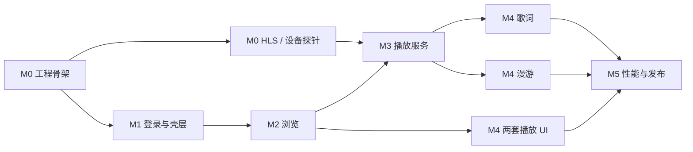

# TV 音乐客户端 V1 实施计划

## 1. 执行原则

本计划在 PRD 与设计评审通过后执行。当前仓库没有客户端代码，因此先建立最小可运行的
原生 Android TV 骨架，再按“契约风险 -> 核心播放 -> 页面完整性 -> 性能”的顺序推进。
每个里程碑都必须能安装、仅用遥控器演示，并保留可运行的自动测试。

推荐单名有经验的 Android 工程师投入约 26-36 个工程日，再预留 3-5 个工作日用于真实
电视和代表性音频回归；即约 6-8 周。该估算包含 PRD 推荐决策 D1 的歌手、专辑和全部
歌曲只读下钻；若评审不确认 D1，M2 删除相应详情/分页/播放来源，预计减少 3-5 个工程日。
若 HLS 服务端契约需要修改，服务端工作单独估算。

## 2. 里程碑

### M0：项目骨架与高风险探针（2-3 日）

**目标**：先证明真实电视与 NAS 的播放链路，不让 UI 完成后才发现 HLS/设备不兼容。

- 建立 Gradle Kotlin DSL、version catalog 与模块：`:app`、`:core:model`、`:core:data`、
  `:core:playback`、`:baselineprofile`。
- 固定 `minSdk=23`、`compileSdk=36`、`targetSdk=36`，固定已核对的稳定依赖版本。
- 建立依赖白名单；不得引入参考 APK 的 Leanback、FFmpeg、Lottie、音效/可视化、WebView
  或无 V1 用途的 Media3 video/DASH/RTSP/IMA/Cronet 模块。
- 侧载/C3 flavor 声明 landscape、TV banner、`android.hardware.touchscreen` required=false，
  并把 `android.software.leanback`、`android.hardware.type.television` 都设为 required=false，
  避免 Android 投影仪因未声明标准 TV feature 被安装过滤；仍提供 Leanback launcher。
  未来若进入 Google Play TV，另建 store manifest overlay，将 TV/Leanback feature 按当时
  TV 质量要求设为 required=true，不让商店过滤规则反向破坏 C3 侧载包。
- 声明 `MediaSessionService` 和 media playback foreground service 权限。
- 建立 release R8、resource shrink、lint、unit test、instrumented test 与 CI 基线。
- 在真实 NAS 上建立只读/可回收测试账号，验证 raw `Authorization` header。
- 在 Vidda C3 Pro 上读取 Android API/ABI、TV/Leanback features、`wm size/density`、解码器
  和 low-RAM 状态；验证 USB/ADB 侧载、系统键盘、遥控器键值、应用列表启动与后台音频。
  若 OEM 启动器不识别 Leanback，再为同一 Activity 增加普通 launcher alias 并回归，
  不分叉业务代码或改变原生 Android 架构；在同时识别两类 category 的 Android TV 上验证
  不出现两个应用图标，`touchscreen` 仍声明为非必需。
- 用代表性 MP3、FLAC、一个不支持源格式和一个 CUE 文件验证：
  direct、Range seek、HLS 创建、manifest/segment 认证、heartbeat、quit 和 NAS 重启恢复。
- 将确认的 HLS codec/profile、heartbeat 单位/周期写成服务端契约测试夹具；若无法确认，
  此里程碑不能宣称播放链路完成。
- 探测 transcode create 的最坏耗时与响应丢失：客户端 timeout 高于已测 mediasrv 上界；
  POST 已发送后超时不得自动重复 create，等待上界后受控 quit/reconcile，再允许手动重试。
- 用专用测试歌词在现有 Web 端分别设置 `+1000/-1000 ms` offset，观察当前行相对音频是
  提前还是延后并恢复原值；把正负方向写入契约夹具，未确认前不实现固定加/减公式。
- 用正式 Android TV emulator 和 Vidda C3 Pro 验证系统键盘、D-pad、媒体键和音频输出。

**退出条件**

- Debug APK 可从 C3 Pro OEM 应用列表启动，也可从 Android TV AVD 的 Leanback launcher
  启动；同时识别两类入口的设备不出现重复图标，触摸屏不是必需项。
- 检查 sideload/store 两个 merged manifest：C3 包的 television/leanback/touchscreen 均不
  造成 feature 过滤；若 C3 未声明 Leanback，其成功安装与应用列表启动就是缺 feature 验证，
  否则再用一个无 Leanback 的普通 Android AVD 做安装烟测。
- MediaSessionService 能播放 direct MP3/FLAC；CUE 只走 HLS 且只播放目标分轨。
- HLS 失败和用户 token 401 能区分，日志无 token/密码。
- Vidda C3 Pro 的 API/ABI/启动器/app surface 与侧载路径已记录；若不支持 API 23 方案，
  回到架构评审，不继续堆叠 UI。

### M1：应用壳、登录与设计系统（3-4 日）

**目标**：形成可登录、可恢复、可用遥控器完整遍历的应用壳。

- 实现 `AppContainer`、导航、启动会话状态机和统一 `AppError`。
- 实现 server origin、稳定 installation deviceId、Keystore token store 和清理逻辑；
  “保持登录”开启才持久化 token，关闭时只放进程内存，密码始终不落盘。
- 实现 host[:port]、origin、`/music/`、完整 API base 输入规范化；粘贴 scheme 时同步 HTTPS
  开关，以结构化 URL API 合成地址；仅接受 HTTP/HTTPS，拒绝 URL 凭据、空 host、其他
  scheme 和跨 host 重定向；用公开 `/sys/config` 校验，
  保留 `serverGUID`、`serverName`、`serverVersion`、`mediasrvVersion`，并以 serverGUID
  隔离 Room/图片缓存、以两个版本字段建立媒体兼容矩阵。
- 兼容构建显式允许 cleartext 以支持运行时 HTTP NAS；所有 OkHttp client 只访问配置 origin，
  拒绝跨 host redirect/HLS URL。另保留 HTTPS-only 构建开关，不实现 trust-all TLS。
- 接入 password-login、user/me、logout；认证只使用 raw Authorization header。
- 登录后以 `(serverGUID,userGUID)` 打开用户数据 namespace；切换账号/登出先停止并清空
  MediaSession、取消图片请求并清空内存图片、断开 Controller UI 投影，再切 namespace；
  图片磁盘 key 同样包含 serverGUID + userGUID。
- 实现登录页的 NAS 地址、最近服务器、账号、密码、可见性、保持登录、HTTPS 开关、
  系统键盘、提交 single-flight 和错误状态；不实现忘记密码或局域网自动发现。
- 建立 TV Theme、色彩、字号、安全边距、焦点描边、按钮、图标按钮、输入框、
  横向内容卡、歌曲行、加载骨架和空/错状态组件。
- 建立首页/我的顶栏与左上角 now-playing 占位；无播放时不可聚焦。
- 为登录和顶栏写 Compose 焦点图测试，覆盖返回键关闭 IME、My Back -> Home、Home Back
  -> finish/background、播放 service 续存和快速重复确认，禁止根页 Back 自循环。

**退出条件**

- 首次安装可仅靠遥控器输入并登录；最近服务器/密码眼睛/保持登录/HTTPS 焦点图无死角，
  无有效地址时初焦 NAS、已有有效地址时初焦账号；错误和离线均可恢复，界面没有忘记
  密码或局域网发现入口，非 HTTP/HTTPS 或内嵌凭据地址不可提交。
- 保持登录开启时 token 重启保留，关闭时不落盘；密码从不保留，普通网络错误不误登出。
- 首页/我的可互相切换且焦点不丢失；720p/1080p 无裁切。

### M2：首页歌单与我的资料库浏览（7-9 日）

**目标**：完成歌单、歌手、专辑和全部歌曲的只读浏览/播放路径，并采用 TV 内容带重做我的。

歌手、专辑和全部歌曲的详情/播放属于 D1 条件范围；本计划按推荐确认后的完整版本拆解，
正式开始 M2 前必须以评审结果冻结。若 D1 被否决，只保留不可聚焦概览并删除对应 API、
页面、队列来源和测试，不能交付有焦点却无动作的卡片。

- 定义 Playlist/Artist/Album/Track/SharedLibrary API DTO、单点 envelope decoder、domain normalization。
- 实现 playlist list/detail/batch-detail 和 playlist track 分页 repository。
- 建立 Room schema：`(serverGUID,userGUID)` namespace、collection/track cache、page key；
  图片 cache key 使用 serverGUID + userGUID + cover identity；配置迁移和跨账号隔离测试。
- Room 分离 essential state 与 evictable page/lyric cache，设置独立 32 MiB 物理文件上限；
  用 LRU/TTL、WAL checkpoint 和 incremental vacuum 回收，不做 190k 全库镜像。
- 接入 Coil 的单例 image loader、认证头、200/400/800 尺寸与有界缓存。
- 建立音频 + 图片 `CacheBudgetManager`：DataStore 默认 512 MiB、128/256/512/1024 选项，按
  media 75% / artwork 25% 分配，并统一计算当前磁盘使用量；额度变化在播放/图片请求安全
  释放点重建 stock LRU cache session，活跃时延迟到曲目结束或下次启动；Room 资料索引
  属于最多另占 32 MiB 的应用数据，设置副文案不得把可调额度描述为整个应用占用。
- 首页实现随机漫游入口和短歌单横行；末项保持下一卡可见提示。
- 实现非一级导航的全部歌单懒网格；首页“查看全部”必须指向该页，不能复用我的。
- 我的实现紧凑账号行和歌手/专辑/音乐库三条横向内容带，不使用三列仪表盘、竖分割线或
  统计数字墙；上下切带、左右浏览、右侧/底部露出后续内容。
- 接入 artist/list/detail、album/list/detail、album/artist-detail/list、
  track/artist-detail/list、track/album-detail/list、track/list 和 shared-library/list；
  隐藏音乐库实际路径，各内容带独立失败。
- 实现全部歌手/全部专辑懒网格、歌手详情、专辑详情和全部歌曲列表；复用
  `CollectionDetailScaffold`、歌曲行和分页器，禁止复制播放逻辑。
- 歌单详情实现头部、播放全部、50 首分页、余 15 首预取、不可访问状态和焦点恢复。
- 恢复首页/我的各内容带/全部网格/collection 详情的 scroll index、offset、focused GUID；
  缓存内容先显示再刷新。
- 为 0、1、50、3500 首和超长中日韩文本建立 UI/Repository 测试夹具。

**退出条件**

- 用户可从首页进入任意歌单；我的按 TV 内容带浏览歌手、专辑和音乐库，可从歌手、专辑
  或全部歌曲进入歌曲列表并播放，且不重复歌单。
- 首屏不等待全部歌单计数/封面；不使用 `size=-1`。
- 3500 首夹具能持续分页滚动，返回后保持原位置，图片不请求原始超大图。

### M3：普通队列与稳定播放（5-7 日）

**目标**：完成可后台运行、可恢复、可降级的核心播放器。

- 实现单例 ExoPlayer、MediaSession、MediaSessionService、MediaController 连接和前台通知。
- 实现 direct authenticated DataSource、Range seek 与播放器错误分类。
- query-token 模式实现 track-scoped `ResolvingDataSource` 与当前票据仓库：每个 manifest/
  segment/key/Range DataSpec 都先剥离旧 `tempToken` 再注入当前值。401 单飞换票后重试同一
  transcode generation；必要时重载同 generation manifest 并恢复位置/播放意图。
- Media3 使用应用唯一 `SimpleCache` + LRU evictor；direct key 使用 server/user/track/
  本地 stream generation/source type，`updatedAt` 只触发验证而不充当文件身份。首次读取
  持久化 ETag/Last-Modified/resourceLength/validatedAt；200 从 Content-Length 取总长，
  206/416 从 Content-Range total 取总长，304 沿用旧值。条件单字节 Range 的 206
  Content-Length 只是响应体长度，禁止当作资源总长；Content-Range 缺失/非法时 fail closed
  全量重取。超过 24 小时或 metadata 变化时验证，validator/resourceLength 变化或无
  validator 过期时清旧 spans 并递增 generation；部分续传
  必须带 `If-Range`，离线只读完整 entry，绝不拼接不同 generation。每次 transcode create
  成功生成新的 `transcodeSessionGeneration`；HLS segment key 再含该 generation、CUE
  范围、转码 profile/rendition 和规范化 segment identity，去掉 token/query。禁止多个
  分片共用 track 级 key，也禁止重建 session 后复用同路径旧分片。
- 实现 `ResolvePlaybackSource`：CUE -> HLS；其他 -> direct；明确解码失败 -> HLS 一次。
- 实现 `TranscodeSessionAdapter`：create、heartbeat、quit、stale recreate。create 必须
  single-flight 且禁用透明重试；仅确认请求未发送时可自动重试。已发送后的 timeout/
  response-lost 进入 ambiguous 状态，等待 M0 冻结的服务端上界后执行受控 quit/reconcile，
  不自动重复 POST；heartbeat 等幂等动作才允许各自的 bounded retry。
- source 降级/重建时快照 position + `playWhenReady`，同一 MediaItem ready 后 seek 回最近
  有效位置并只按原意图恢复；覆盖暂停、播放中、普通轨和 CUE 分轨相对位置测试。
- 实现普通队列 reducer 和分页追加：播放全部、从单曲开始、上一首、下一首、seek。
- QueueSource 覆盖 Playlist/Artist/Album/LibraryAllTracks，复用同一分页追加和恢复状态机。
- QueueCursor 保存绝对 index/source/page keys，Media3/Room 只保留当前前后各 2 页、最多
  约 250 项的滑动窗口；跨边界按需加载并在新页提交后移除远端页，禁止把 190k 全部歌曲
  GUID 一次装入 timeline 或快照。
- 队尾分页 single-flight，自动退避 0.5/1/2 秒；结果按 GUID 去重后原子提交。三次失败仍
  保留已加载顺序/页码，抵达队尾时进入带手动重试的暂停态，不误判自然结束。
- 因服务端没有 playlist revision/snapshot，顺序与绝对 index 保证限定在无外部并发修改的
  稳定排序数据集。分页保存首尾锚点/known total；检测到漂移时停止拼接并提示“歌单已更新，
  重新载入”。外部修改可延后反映，不能通过 GUID 去重伪称没有漏项。
- Room 保存队列 GUID、来源、顺序、当前项、位置；恢复时暂停且重新解析元数据。
- 把 now-playing pill 接到 MediaController；确认返回播放器，不重新 prepare。
- 实现音频焦点、媒体键、前后台、HDMI/输出中断和服务停止策略。
- 用 MockWebServer 覆盖 200/206/304/401/416/502、200 + JSON 业务错误体、断网、超时和
  token 脱敏。query tempToken 401 必须只换新票并重试同一 transcode generation；raw 用户
  Authorization 401 先 `/user/me`，确认失效才登出；HLS 404/session-not-found 才重建
  transcode。覆盖长曲目 temp token 过期不重转码、用户 token 真失效会登出两条路径。
- 夹具 manifest 内嵌旧 tempToken；segment 401 后第二次请求必须剥离旧值、带新票据，
  保持同一 transcodeSessionGeneration 且 transcode POST 调用数不增加。
- 对 200/206/304/416 分别断言 resourceLength 解析与沿用规则；206/416 缺失或非法
  Content-Range 必须清旧 generation 全量重取，不能合并缓存。
- 用 response-lost/读超时夹具断言 transcode POST 最多一次；ambiguous outcome 不自动
  create，经过上界等待和受控清理后才暴露手动重试。
- 转码 create/heartbeat/quit 只有 `data.status == "success"` 才成功，null、unknown 和
  `failed` 都 fail closed 并覆盖契约测试。
- 覆盖同 track/profile 连续建立两个转码 session 且 segment 文件名相同：第二个 session
  必须使用新 generation，任何旧 session span 都不可命中。
- 缓存额度不预分配；覆盖 ENOSPC、I/O 和索引损坏。所有写失败均绕过磁盘缓存并继续
  网络播放/图片加载，当前音频不停止；在安全点重建应用私有 cache session 并报告真实用量。
- 覆盖 track/access 的 `100004/100005`、`accessStatus != 0`、token 失效与账号禁用：
  停止/跳过被拒 track，只删除该 track 的 media spans 与相关 artwork key，禁止 confirmed
  denial 后离线命中；只有用户 token 失效/账号禁用才关闭并清理整个用户 namespace。
  HLS session-not-found `100005` 只重建 transcode、不做内容撤权清理。冷启动离线未完成
  `/user/me` 前不允许缓存音频起播。

**退出条件**

- 播放全部和单曲路径均可连续播放，上一首/下一首/seek 正确。
- 页面切换和 app 退后台不断音；冷启动不自动出声，但可从 now-playing 恢复。
- direct 不支持时只降级一次；HLS stale 重建不导致回登录；队列无重复 player。
- 固定 190k synthetic collection 跨 500 页后 timeline/Room 仍 <=250 项，previous/next、
  绝对 index 与顺序正确，内存不随已浏览页数线性增长；并发增删夹具触发可恢复重载。

### M4：歌词、随机漫游与两套播放页（4-5 日）

**目标**：完成用户要求的全部 V1 功能和两套沉浸式表现。

- 在 `:core:model` 实现纯 Kotlin LRC parser 和 timeline：BOM、metadata、多时间戳、
  小数精度、坏行、offset、静态歌词和同时间双语分组。
- `applyLyricOffset` 只能使用 M0 已冻结的符号契约，并分别覆盖 `+1000/-1000 ms`；若 M0
  未得到确定结果，M4 不得以猜测公式通过歌词验收。
- LyricsRepository 独立于音频加载，按 server/track/lyric/updatedAt 缓存原文与解析结果。
- 以最多 4 Hz 的位置采样和二分查找驱动 active lyric，只在行变化时滚动。
- 实现封面模式：清晰方形封面、歌曲信息、宽歌词列、按需显示控制层。
- 实现大海报模式：左侧 `ContentScale.Inside` 大图（不放大低清图）、右侧元数据与双语
  歌词、缺图占位和比例适配。
- 大海报单独加载不带 size 的原图，按 20 MiB、8192 px 单边和 16 MP 总像素设硬限；
  1080p/low-RAM 解码长边约 1200 px，C3 Pro 原生 4K surface 可提高到约 1920 px；
  不满足时回退 800 px 方形缩略图。列表不得复用此原图管线。
- 主色提取一次并缓存；背景不用实时 blur、shader 或第二张全屏 bitmap。
- 我的设置任务页加入播放界面 segmented control；初始默认大海报，选择后留在设置页并
  持久化，之后进入播放器按偏好渲染且进度不变。
- 设置页加入缓存上限与当前用量；调低额度在 cache session 安全重建点生效，清除缓存
  先移除图片和未锁 media span，等待活跃 span 释放且不打断当前播放。
- 两个播放器页面都不得出现布局切换按钮、模式标签或常驻设置入口；只在遥控器交互时
  临时显示 transport controls。
- 实现 roam-start/next/previous、single-flight、next 预取、stale restart 和普通队列冻结恢复。
- 重复确认首页漫游入口时，若已在漫游只回当前播放器，不重复 start、不覆盖最初普通队列
  快照；覆盖 Back 到首页 -> 再点漫游 -> 退出仍恢复原普通队列/位置的回归测试。
- 覆盖 roam-start `data=null`、previous/next neighbor null：空结果留在首页并保持焦点，
  空 neighbor 禁用/省略对应控制，不进入空播放器或发送无 relativeRoamId 请求。
- 漫游临时控制层加入“退出漫游”：恢复漫游前普通队列/歌曲/位置但保持暂停；无旧队列时
  停止并回首页。开始新的歌单播放则明确替换旧普通队列。
- 全播放器 D-pad：隐藏时方向键第一下只显控件并聚焦播放键、不 seek；确认可直接播放/暂停
  并短暂显控件；显控件后进度条左右 seek 10 秒，返回先隐藏控制再离开。

**退出条件**

- 首次播放使用大海报；从设置改为另一布局后重新进入同一歌曲不重建 player、不跳进度，
  重启后保留选择。
- 缓存首次默认为 512 MiB，四个额度选择可持久化；调低与清理不造成当前曲目中断。
- LRC 与 offset 同步；静态/无/失败歌词不影响音频；双语当前组层级清楚。
- 漫游能连续 previous/next，快速按键不创建多个 session，退出后普通队列不变。
- 方形、横向、纵向、低清、缺失五类封面均不拉伸、不遮挡歌词。
- 漫游显式退出能恢复旧队列且不自动发声；普通 Back 只离开播放器，不误结束漫游。

### M5：性能、无障碍与发布候选（4-6 日）

**目标**：把功能完成的构建变成能在 C3 Pro 长期运行、并具备可测低内存降级能力的发布候选。

- 完成 Baseline Profile：启动、首个焦点、首页横滑、歌单纵滑、打开播放器。
- 完成 Macrobenchmark 和真实设备数据：TTID/TTFD、焦点延迟、滚动帧、可听时间、PSS。
- 在 Vidda C3 Pro 实际 app surface 上跑完整启动、direct/HLS、歌词、图片、2 小时内存与
  温度门槛；AVD 结果只作确定性回归旁证。
- 根据 `isLowRamDevice()` 降低图片 cache/prefetch，检查长时间播放与页面往返内存回收。
- 在 720p/1080p/4K 和 overscan 屏幕做截图测试，检查超长文字与字体 fallback。
- 使用标准遥控器和带媒体键遥控器执行全部焦点图、长按/连按和返回栈回归。
- 执行 2 小时普通队列、2 小时漫游、NAS 重启、网络切换、HLS token 长曲目测试。
- 开启 R8/resource shrink，审计 APK/AAB 体积、权限、cleartext 配置和 secret 日志。
- 完成崩溃/诊断最小日志：请求 ID、错误类别、track GUID hash、播放源类型；不记录凭据。
- 生成签名候选包、版本说明、已知设备例外和回滚说明。

**退出条件**

- 满足 `design.md` 性能和发布硬门槛；所有 PRD acceptance criteria 有对应测试证据。
- 正式 TV emulator 与 Vidda C3 Pro 完成回归；Pixel phone AVD 不作为 TV 验收证据。
  第二类 2 GB 真机未完成前，仅发布 C3 Pro 验收结论，不宣称广泛低配 TV 兼容。
- 连续播放、漫游、歌词和设置没有 P0/P1 已知问题。

## 3. 任务依赖图



M0 的 HLS/硬件探针与工程骨架可并行；M2 的数据层与静态 UI 可并行。播放器服务、
队列和 player UI 必须共享一个 MediaController 合同，不适合交给互不沟通的并行实现。

## 4. 推荐代码落点

```text
app/src/main/java/.../
  MainActivity.kt
  TvMusicApplication.kt
  navigation/
  ui/designsystem/
  feature/auth/
  feature/home/
  feature/my/
  feature/playlist/
  feature/player/
  feature/settings/

core/model/src/main/java/.../
  auth/ collection/ media/ playback/ lyric/ error/

core/data/src/main/java/.../
  api/dto/ api/decoder/ api/service/
  repository/ database/ preferences/ security/ image/

core/playback/src/main/java/.../
  PlaybackService.kt
  PlaybackSession.kt
  source/ queue/ roam/ controller/

baselineprofile/src/main/java/.../
  StartupProfile.kt
  BrowseAndPlayBenchmark.kt
```

包名和 applicationId 在 M0 由用户确认后一次确定。工作名、图标和签名信息不应混入
领域包或 API 模型。

## 5. 测试追踪

| PRD 验收 | 主要自动证据 | 主要人工/设备证据 |
| --- | --- | --- |
| 输入登录，无扫码 | Auth ViewModel + Compose IME/focus tests | NAS/最近服务器/账号/密码/保持登录/HTTPS 全遥控器路径 |
| 仅首页/我的 + now-playing | Navigation/focus tests | 顶栏四向遍历、播放器返回 |
| 歌单和播放全部 | Paging/queue tests | 3500 首真实/夹具歌单 |
| 我的 TV 内容带与资料库浏览 | Artist/Album/Track repository + focus tests | 三条内容带、详情返回与全部歌曲 |
| 单曲进入大屏 | MediaController integration | 从不同滚动位置进入/返回 |
| 两套播放布局持久化 | DataStore 默认值 + layout state tests | 设置内切换、播放器无模式控件、五类封面 |
| 512 MiB 默认缓存与调整/清理 | Cache key/eviction/session tests | 播放中调低、清理、权限撤销、重启生效、跨账号隔离；190k 元数据下 Room <=32 MiB |
| 同步歌词 | LRC corpus tests | 多语/offset/长歌词 |
| 随机漫游 | Roam reducer + stale fixtures | NAS 重启、快速 next/previous |
| 焦点与性能 | Compose tests + Macrobenchmark | C3 Pro 必测；低档真机扩展兼容，连按/长按/overscan |

## 6. 可选服务端增强

以下增强能降低客户端兼容复杂度，但不应悄悄扩大 TV V1 范围：

1. **P0 建议**：增加 transcode capability/profile 接口，并明确 heartbeat 时间单位、周期、
   token 续期和 session 状态；否则先将 M0 验证出的 profile 作为单服务版本兼容表。
2. **P1**：增加 `/playlist/playback-snapshot`（revision + 稳定游标/顺序），让长队列在 NAS
   端并发编辑时仍能证明无漏项；当前客户端只能检测部分漂移并请求重载。
3. **P1**：transcode create 接受 idempotency key，并提供按 user/device/track 查询/回收当前
   session 的 status/reconcile 接口，消除响应丢失后的 ambiguous outcome 和旧 PlayLink 泄漏。
4. **P1**：登录返回 token expiredAt 并提供 refresh，避免每 30 天重新遥控器输入密码。
5. **P1**：提供标准化歌词 timeline，客户端仍保留 raw LRC 兼容。
6. **P2**：提供服务 restart generation/session version，减少通过错误猜测 HLS/漫游失效。
7. **P2**：歌单列表提供分页和 trackCount，降低超大账号的首屏负担。

如服务端不修改，`design.md` 中的客户端 fallback 仍能完成 V1；唯独 HLS codec 与 heartbeat
必须在 M0 被实测并形成可执行契约。

## 7. 开工前输入

- 首发电视/盒子的品牌型号、Android 版本、内存与常用输出分辨率。
- 一个可用于开发的 NAS 账号，以及不含隐私的代表性 MP3/FLAC/不支持格式/CUE 测试集。
- 应用正式名称、applicationId、图标/TV banner 与签名归属；没有时可先用明确占位。
- 服务器地址是否随安装可编辑。当前方案默认登录页可编辑并保存最近有效地址。
- 是否通过应用商店发布；若只侧载，也仍按 target 36 与签名升级路径构建。

这些输入不阻塞方案评审，但首发硬件与 HLS 测试集是 M0 退出条件。

## 8. Definition Of Done

- `prd.md` 全部验收项有通过证据，且没有用后续范围替代失败项。
- release 构建通过 format/lint/unit/instrumented/Compose/Media3/Macrobenchmark 约定门槛。
- 首页、我的、歌单、播放器、设置在 720p/1080p/4K 不越界，真机无焦点死角。
- direct、HLS、CUE、歌词、漫游和 3500 首队列均通过代表性测试。
- 安全审计确认密码不落盘，token/临时票据不进日志，HTTP 风险对用户可见。
- Vidda C3 Pro 满足发布性能预算；低档设备结果单独记录，未实测时不得扩大兼容声明。
- 用户确认两套播放页和首页/我的视觉稿，原创边界未被回退为参考产品复制。
- 安装包、签名、升级和回滚路径被实际演练并记录。
