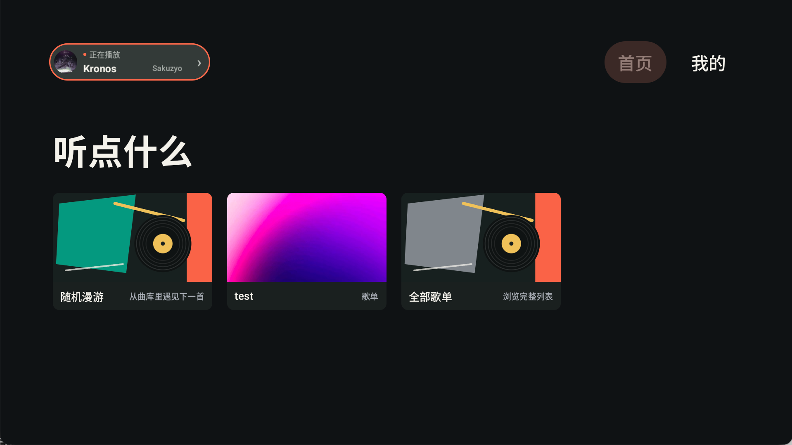
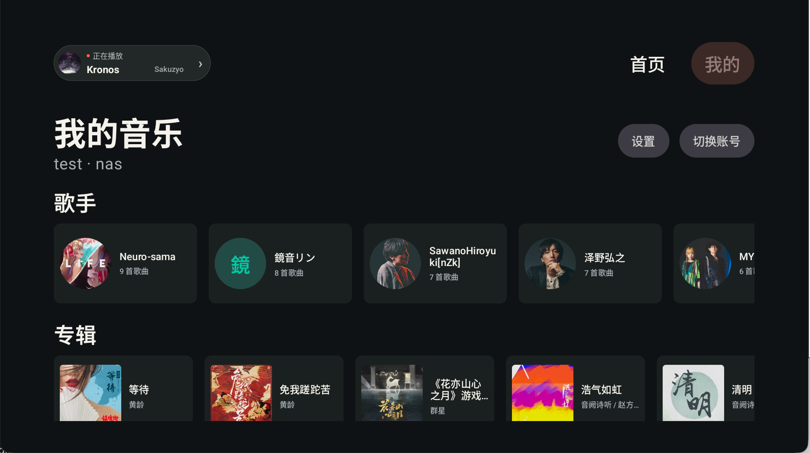
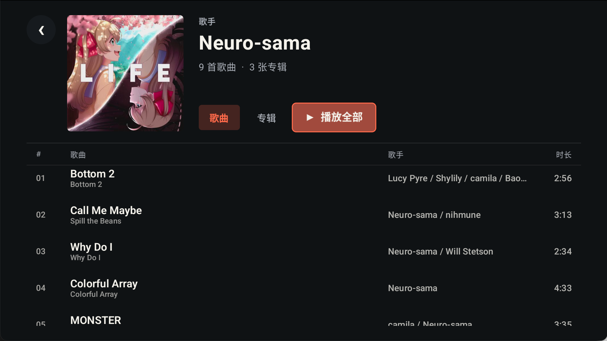
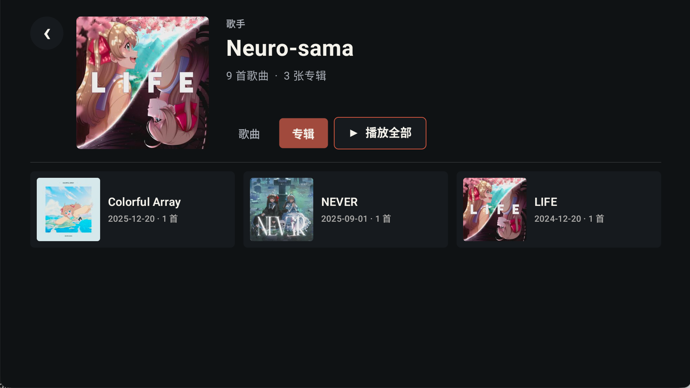
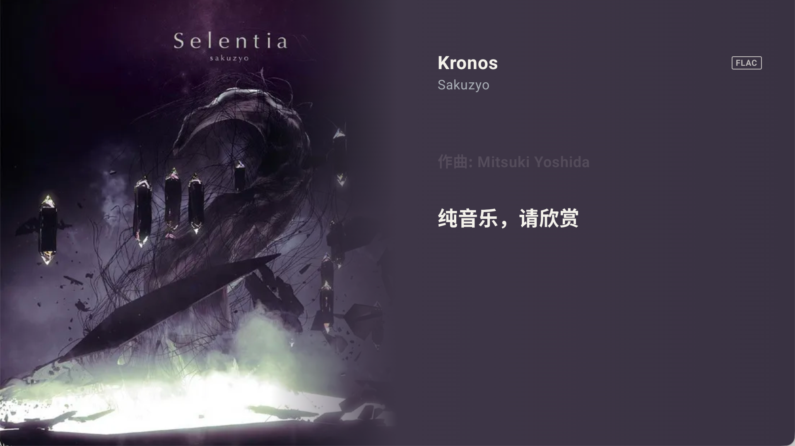

<p align="center">
  
</p>

<h1 align="center">回声台</h1>

<p align="center">面向 Android TV 与 Android 投影设备的飞牛音乐第三方客户端</p>

项目使用 Kotlin、Compose for TV 与 Media3 构建，针对电视大屏、横屏布局和遥控器操作
进行了适配。

> 本项目为第三方客户端，与飞牛官方无关。使用前请确保已经部署可访问的飞牛音乐服务，
> 并遵守相关服务条款。

## 主要功能

- **电视端原生体验**：适配 Android TV 启动器、横屏显示与 D-pad 遥控器焦点操作。
- **音乐库浏览**：支持歌单、歌手、专辑和全部歌曲浏览，可进入详情页播放完整列表。
- **随机漫游**：从音乐库持续发现歌曲，并支持上一首、下一首和退出漫游。
- **完整播放队列**：支持列表循环、随机播放、单曲循环与顺序播放。
- **沉浸式播放器**：提供 CD 模式和大海报模式，可在设置中随时切换。
- **歌词显示**：支持逐行歌词、普通文本歌词以及歌词偏移。
- **多服务器登录**：支持 HTTP/HTTPS、登录状态恢复和最近使用的服务器记录。
- **本地缓存**：缓存封面与音乐库资料，可设置图片缓存上限并手动清理。

## 界面预览

| 首页 | 我的音乐 |
| --- | --- |
|  |  |

| 歌手歌曲 | 歌手歌专辑 |
| --- | --- |
|  |  |

| 播放控制 | CD 播放器 |
| --- | --- |
|  |  |

<p align="center"><strong>大海报播放器</strong></p>
<p align="center">
  
</p>

## 安装

### 下载预编译版本

前往 [Releases](https://github.com/QiaoKes/fn-music-tv/releases) 下载最新版通用 APK：

```text
fn-music-tv-<version>-universal.apk
```

通用包包含 `arm64-v8a`、`armeabi-v7a`、`x86` 与 `x86_64`，支持 Android 6.0 及以上
系统。下载后可通过 U 盘、文件管理器或 ADB 安装：

```sh
adb install fn-music-tv-<version>-universal.apk
```

若系统拦截安装，请在设备设置中允许当前文件管理器或安装工具“安装未知应用”。

### 首次登录

1. 打开回声台，填写飞牛音乐服务的 NAS 地址。
2. 根据服务配置选择是否启用 HTTPS。
3. 输入账号和密码；需要自动恢复会话时保留“保持登录”。
4. 选择“登录”，进入首页后即可使用遥控器浏览和播放音乐。

## 遥控器操作

| 按键 | 操作 |
| --- | --- |
| 方向键 | 移动焦点、浏览列表或选择播放器控制项 |
| 确认键 | 打开页面、播放歌曲或执行当前操作 |
| 返回键 | 返回上一级；首页连续按两次退出应用 |

播放页面的控制栏会自动隐藏。按方向键或确认键可再次显示控制项；首页左上角的当前播放入口
可快速返回播放器。

## 从源码构建

环境要求：

- JDK 21
- Android SDK 36
- Android SDK Platform Tools

克隆项目并构建侧载调试包：

```sh
git clone https://github.com/QiaoKes/fn-music-tv.git
cd fn-music-tv
./gradlew :app:assembleSideloadDebug
```

产物位于：

```text
app/build/outputs/apk/sideload/debug/
```

执行完整的本地质量检查：

```sh
./gradlew \
  :core:model:test \
  :core:data:testDebugUnitTest \
  :core:playback:testDebugUnitTest \
  :app:testSideloadDebugUnitTest \
  :app:lintSideloadDebug \
  :app:lintStoreDebug
```

## 项目结构

```text
app/            Android TV 应用、Compose 界面与应用集成
core/model/     音乐库、队列、播放模式等领域模型
core/data/      服务端 API、会话、本地数据库与缓存
core/playback/  Media3 播放服务与队列
baselineprofile/ 基准配置生成模块
```

## 兼容性说明

- 当前客户端不会猜测尚未通过真实 NAS 验证的 CUE/HLS 转码参数；服务端参数未确认时，
  对应歌曲会提示兼容播放暂不可用。
- 不同电视和投影设备对 Android TV feature、音频编码及后台限制的实现可能不同，目前只在vidda c3 pro 与 google 盒子上通过测试

## 特别感谢

- AndroidX、Compose for TV 与 Media3 等开源项目为本项目提供了基础能力。

## 开源许可

本项目采用 [GNU General Public License v3.0](LICENSE) 开源。你可以在 GPL-3.0 条款下
使用、修改和分发本项目；分发修改版本时也需要以 GPL-3.0 开源并提供相应源代码。
